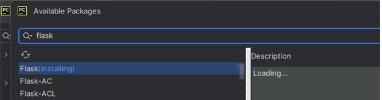

# Flask-Web-Service-Build

## Building a Web Service with Flask to talk to News API "https://newsapi.org/" and Deploying it on Github/Render.

### Technologies Used
* Flask for Web Service
* BeautifulSoup and Requests for web scraping
* HTML/CSS/Bootstrap for UI development.

### API
The API used in this application is news API https://newsapi.org/docs/authentication

Sample API KEY for testing: 11faa92d11d849c6ab86f167601dda93

### Flask Web Service:
Flask application would ask the user to enter any keyword that he needs to search along with the API KEY.

Then the application interacts with the News API and renders title, description, author, image, and news url in a grid view for the user to see.

Further it facilitates the user to click on each url and navigate to the original news source if necessary.

### Deployment

This application is deployed on render at https://flaskwebservice.onrender.com/.

### Setting up development environment

Following is performed in PyCharm IDE.

Install Flask in the path File > Settings > Python Interpreter > Flask > Install

Package requirements requests and gunicorn will need to be installed.

